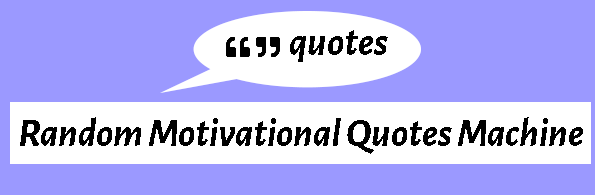
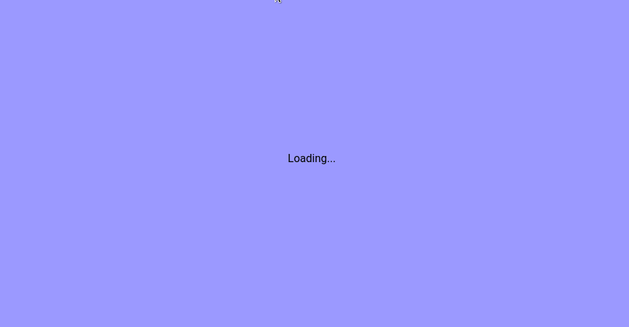

<!-- Badges -->
<p>
  
  <a href="#" target="_blank">
    
  </a>
  <a href="https://twitter.com/redacuve" target="_blank">
    
  </a>
</p>


<!-- Project Header -->
  <p align="center">
    
  <br>
  </p>
  <h1 align="center">Project Random Motivational Quotes Machine</h1>
  <p align="center">
  <br>
   <a href="https://github.com/redacuve/Random-Quote-Machine"><strong>Explore the repo »</strong></a>
  <br>
    <a href="https://github.com/redacuve/Random-Quote-Machine/issues">Request Feature</a>
  </p>
  <h2 align="center"><a href="https://random-motivational-quotes.netlify.app/"><strong>Live Link!</strong></a></h2>

<!-- TABLE OF CONTENTS -->

## Table of Contents

* [About the Project](#about-the-project)

* [Built With](#built-with)

* [Getting Started](#getting-started)

* [How it Works](#how-it-works)

* [Contributing](#contributing)

* [License](#license)

* [Contact](#contact)

* [Acknowledgements](#acknowledgements)

<!-- ABOUT THE PROJECT -->

## About The Project

This is a simple project build with REACT.
This is s simple Random quote visualizer. you can click on the new quote button and you will give one of 408 different quotes, also you can click on tweet quote and you will be able to tweet that quote.

<p align="center">
    
</p>

### Built With

* [React](https://reactjs.org/docs/getting-started.html)

* [HTML5](https://developer.mozilla.org/es/docs/HTML/HTML5)

* [CSS](https://developer.mozilla.org/es/docs/Web/CSS)

* Deployed with
    * [netlify](https://docs.netlify.com/)

<!-- GETTING STARTED -->
## Getting Started

To get a local copy up and running follow these simple steps.

Clone or fork the <a href="https://github.com/redacuve/Random-Quote-Machine">repo</a> [git@github.com:redacuve/Random-Quote-Machine.git]

*note you need have install npm or yarn
* [npm](https://www.npmjs.com/get-npm)
* [yarn](https://classic.yarnpkg.com/en/docs/install)


<!-- HOW IT WORKS -->
## How it Works

I made a JSON with 408 quotes, the quotes were taken from here: https://www.oberlo.com/blog/motivational-quotes.
When the component is mounted it fetch the JSON and converts it to an array, the array is set inside the state, when you click on a new quote it changes the index in the state to a random number and then another quote is displayed.
You get a different quote every time!

### Running the code

*   Navigate to the root directory of the project

*   Run this command on your terminal to run the code locally on http://localhost:3000:
    ```
    $ npm start
    ```
*   Also you can build this app for production, react are going to make a build folder with minified files, and filenames with hashes for best performance
    ```
    $ npm build
    ```
*   You can learn more in the [Create React App documentation](https://facebook.github.io/create-react-app/docs/getting-started).

* To learn React, check out the [React documentation](https://reactjs.org/).

<!-- CONTRIBUTING -->

## Contributing

Contributions are what make the open source community such an amazing place to be learn, inspire, and create. Any contributions you make are **greatly appreciated**.

1. Fork the Project

2. Create your Feature Branch (`git checkout -b feature/AmazingFeature`)

3. Commit your Changes (`git commit -m 'Add some AmazingFeature'`)

4. Push to the Branch (`git push origin feature/AmazingFeature`)

5. Open a Pull Request

<!-- LICENSE -->

## License

This project is under the <a href="https://www.gnu.org/licenses/gpl-3.0.html">GNU Public License V3</a>. For more information see <a href="https://github.com/redacuve/Random-Quote-Machine/blob/master/LICENSE">here</a>

<!-- CONTACT -->

## Contact

Rey David Cuevas Vela - [@redacuve](https://twitter.com/redacuve) - redacuve@gmail.com -[linkedin.com/in/redacuve/](https://www.linkedin.com/in/redacuve/)

Project Link: [github.com/redacuve/Random-Quote-Machine](https://github.com/redacuve/Random-Quote-Machine) - Random Motivational Quotes Machine.

## Acknowledgements

A big thanks to Nicole Martins Ferreira.<br>
Quotes are taken from here: https://www.oberlo.com/blog/motivational-quotes.<br>
The JSON of quotes is here: https://gist.github.com/redacuve/0c12440a55d4280ce459d2148e17c971